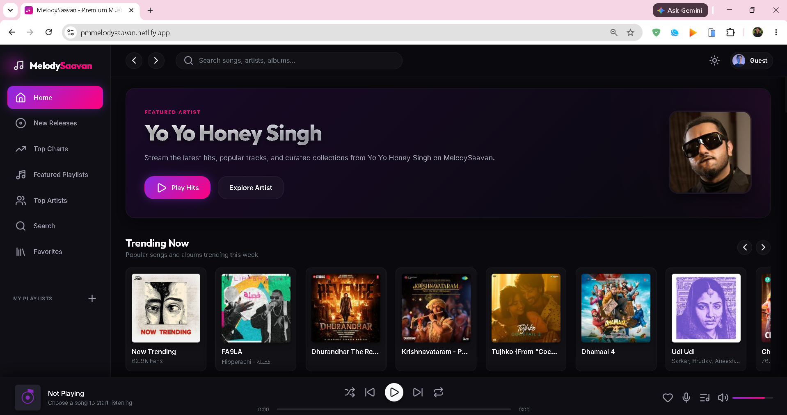
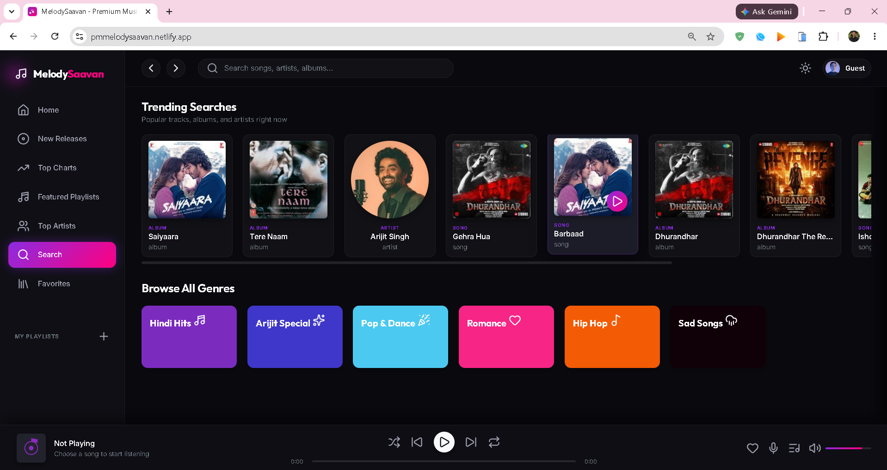
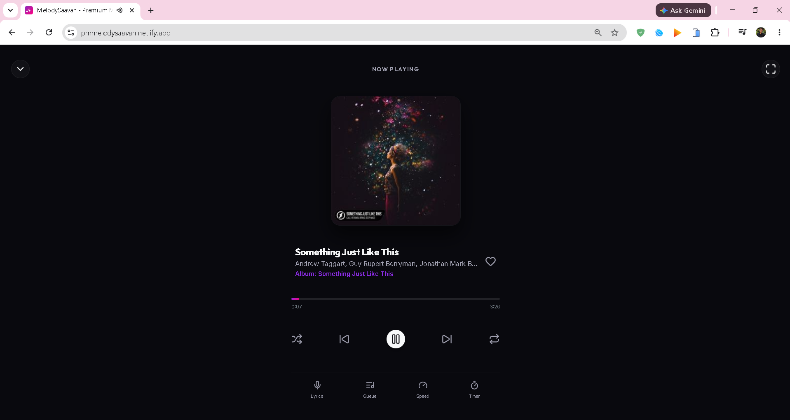
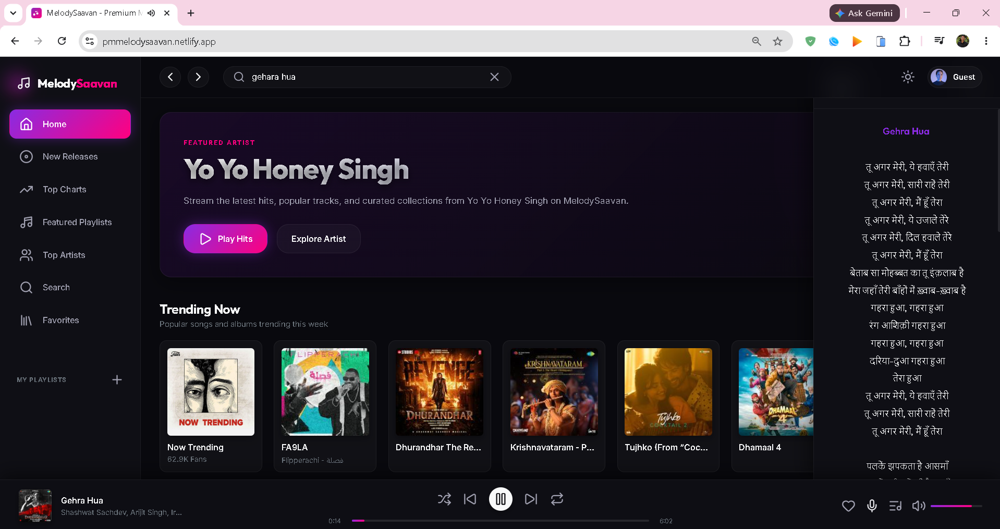
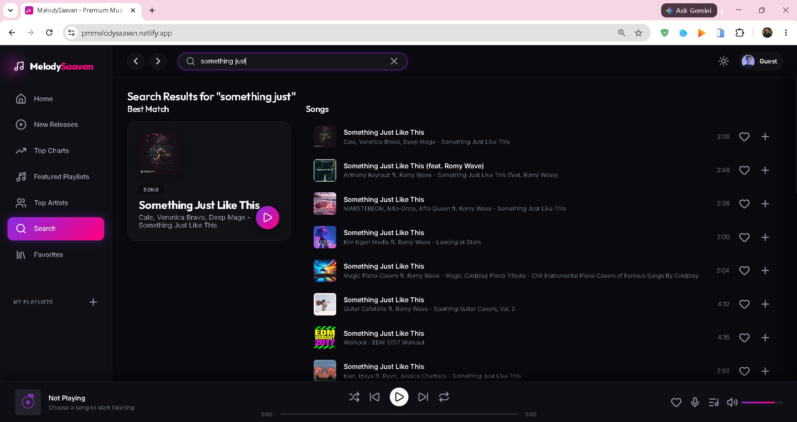
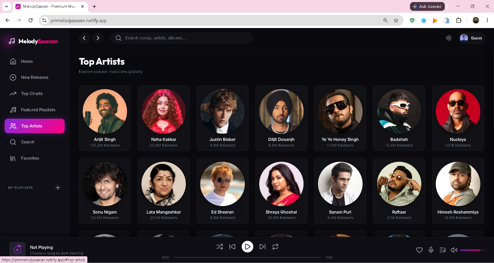

# 🎵 MelodySaavan UI

<div align="center">

### A Beautiful Cross-Platform Music Streaming Client for MelodySaavan API

Modern • Lightweight • Responsive • Android Ready


</div>

---

# 📖 Overview

**MelodySaavan UI** is the official frontend client for the **MelodySaavan API**.

It provides a fast, responsive, and elegant music streaming experience powered by the MelodySaavan backend. Built with modern JavaScript and packaged using Capacitor, the application runs seamlessly in both web browsers and Android devices.

---

# ✨ Features

- 🎵 Stream music instantly
- 🔍 Fast song search
- ❤️ Like and unlike songs
- 📃 Playlist support
- 💿 Album browsing
- 👨‍🎤 Artist pages
- 🎤 Lyrics support
- ⚡ Responsive design
- 📱 Android application support
- 🌐 REST API powered
- 🚀 Lightweight architecture

---

# 🚀 Getting Started

## Prerequisites

- Node.js 18+
- npm
- Android Studio (Optional for Android)
- Java 17+ (Android builds)

---

## Clone Repository

```bash
git clone https://github.com/prasadm11/MelodySaavan-UI.git

cd MelodySaavan-UI
```

---

## Install Dependencies

```bash
npm install
```

---

## Run Development Server

```bash
npm run dev
```

Application will be available at

```
http://localhost:3000
```

---

## Production Build

```bash
npm run build
```

Production files are generated inside

```
dist/
```

---

# 📱 Android Build

Sync Capacitor

```bash
npx cap sync
```

Open Android Studio

```bash
npx cap open android
```

Build and run the application from Android Studio.

---

# 🔗 Backend API

This frontend communicates with the MelodySaavan Backend API.

Backend Repository

```
https://github.com/prasadm11/MelodySaavan
```

---

# 🛠️ Tech Stack

- JavaScript (ES6)
- HTML5
- CSS3
- Node.js
- Express.js
- Capacitor
- Android

---

# 📂 Project Structure

```text
MelodySaavan-UI
│
├── android/
├── dist/
├── app.js
├── index.html
├── index.css
├── build.js
├── server.js
├── package.json
├── capacitor.config.json
└── README.md
```

---

# 📸 Screenshots


<div align="center">









</div>

---

# 🎯 Roadmap

- [x] Music Streaming
- [x] Search
- [x] Responsive UI
- [x] Android Support
- [ ] Playlist Management
- [ ] User Authentication
- [ ] Offline Playback
- [ ] Download Songs
- [ ] Theme Customization

---

# 🤝 Contributing

Contributions are welcome!

1. Fork the repository.
2. Create a feature branch.
3. Commit your changes.
4. Push the branch.
5. Open a Pull Request.

---

# 📄 License

Distributed under the MIT License.

See the LICENSE file for more information.

---

# ❤️ Acknowledgements

- MelodySaavan Backend API
- Capacitor
- Express.js
- Node.js

---

<div align="center">

### ⭐ If you like this project, consider giving it a Star!


</div>